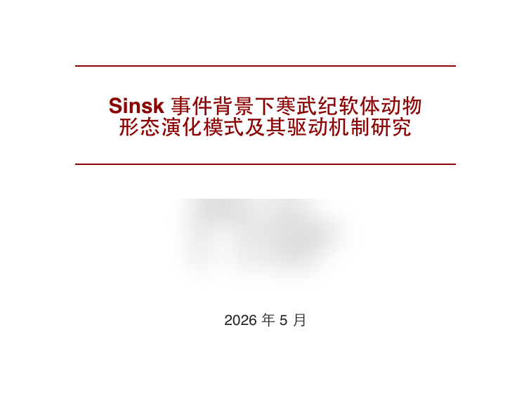
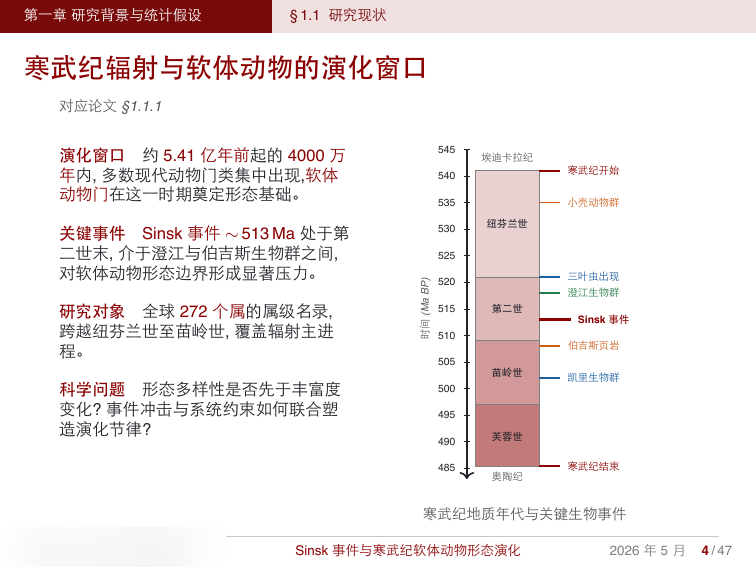
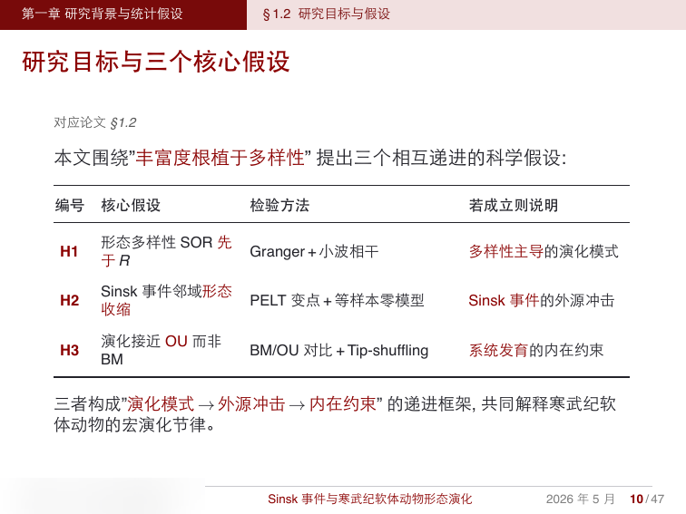
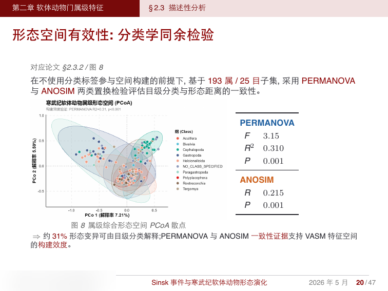
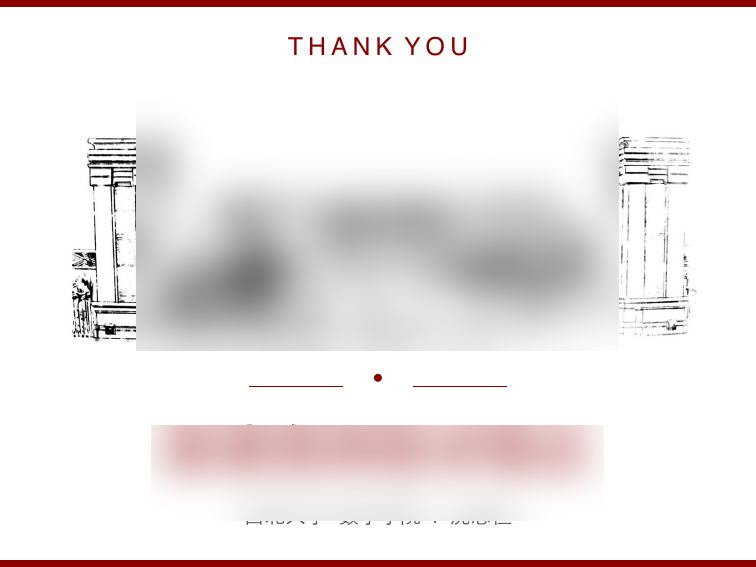

# Beamer Academic

一键从论文生成高质量学术答辩 Beamer 幻灯片。适用于 [Claude Code](https://docs.anthropic.com/en/docs/claude-code) / [Codex](https://openai.com/index/codex/) 等 AI 编程助手的 Skill。

> 小红书爆款 SOP 的 Skill 化升级版 —— 从"手动起 4 个 Agent"进化为"一句话生成答辩 PPT"

## 效果展示

以下为实际生成的答辩 PPT 截图（个人信息已模糊处理）：

| 封面页 | 多级目录页 |
|:---:|:---:|
|  |  |

| 左文右图版式 | 表格+假设版式 |
|:---:|:---:|
|  |  |

| 图+统计结果版式 | 致谢页 |
|:---:|:---:|
|  |  |

## 特性

- **一键生成**：只需提供论文 PDF，自动完成素材提取→大纲生成→内容填充→编译
- **13 种专业版式**：封面、目录、章节分隔、纯文段、左文右图、左图右文、公式页、表格页、满版图、结论框、过渡页、列表页、致谢页
- **交互式修改**：生成后支持按页码精准修改，无需懂 LaTeX
- **5 种配色方案**：蓝（理工通用）、红（人文社科）、绿（农林环境）、紫（文科艺术）、青（医学海洋）
- **多场景通用**：答辩、开题、学术会议报告

## 快速开始

### 1. 安装

将本仓库克隆到 Claude Code 的 skills 目录：

```bash
git clone https://github.com/Faust-Donf/beamer-academic.git ~/.claude/skills/beamer-academic
```

### 2. 前置依赖

确保系统已安装 XeLaTeX（中文排版需要）：

```bash
# macOS
brew install --cask mactex

# Ubuntu/Debian
sudo apt install texlive-xetex texlive-lang-chinese texlive-fonts-recommended
```

### 3. 使用

```bash
# 把论文放到一个空文件夹
mkdir my-defense && cp 论文.pdf my-defense/
cd my-defense

# 在 Claude Code 中运行
# 输入: /beamer-academic
# 或者直接说: "帮我做答辩PPT"
```

## 工作流程

```
论文.pdf
    │
    ▼
┌─────────────────┐
│ Step 1: 素材提取  │  提取图片、表格、公式、章节结构
└────────┬────────┘
         ▼
┌─────────────────┐
│ Step 2: 大纲生成  │  自动分配版式，生成 outline.md
└────────┬────────┘
         ▼
    ★ 用户确认大纲 ★   ← 唯一需要人工介入的环节
         │
         ▼
┌─────────────────┐
│ Step 3: 内容生成  │  逐页填充版式模板
└────────┬────────┘
         ▼
┌─────────────────┐
│ Step 4: 编译     │  xelatex → defense.pdf
└────────┬────────┘
         ▼
┌─────────────────┐
│ Step 5: 交互修改  │  按页码提修改 → 自动重新编译
└─────────────────┘
```

## 版式库

| 版式 | 适用场景 | 示例 |
|------|---------|------|
| `cover` | 第一页，论文标题+个人信息 | 封面 |
| `toc` | 全文章节大纲 | 目录 |
| `section-divider` | 每章开头，全色底+序号 | 分隔页 |
| `text-only` | 概念解释、背景叙述 | 纯文段 |
| `text-left-image-right` | 文字为主+配图辅助 | 左文右图 |
| `image-left-text-right` | 图为主体+文字解读 | 左图右文 |
| `formula` | 核心公式/模型定义 | 公式页 |
| `table` | 实验结果、数据对比 | 表格页 |
| `full-image` | 大图/多面板/热力图 | 满版图 |
| `conclusion-box` | 核心结论高亮 | 结论框 |
| `transition` | 承上启下，引出下一章 | 过渡页 |
| `list` | 创新点、局限性、展望 | 列表页 |
| `thanks` | 最后一页致谢 | 致谢页 |

## 配色方案

| 方案 | 色值 | 推荐学科 |
|------|------|---------|
| 蓝色（默认） | `rgb(26, 58, 92)` | 理工科通用 |
| 红色 | `rgb(139, 0, 0)` | 人文社科、传统高校 |
| 绿色 | `rgb(0, 100, 60)` | 农林、环境、生科 |
| 紫色 | `rgb(75, 0, 110)` | 文科、艺术 |
| 青色 | `rgb(0, 80, 100)` | 医学、海洋 |

在 `theme/config.yaml` 中修改 `color_scheme` 即可切换。

## 自定义

### 换成自己学校的样式

编辑 `theme/config.yaml`：

```yaml
institution:
  name: "你的大学"
  department: "你的学院"
  logo: "your-logo.png"        # 放到项目目录
  gate_image: "your-gate.png"  # 致谢页用（可选）

color_scheme: "red"  # 或自定义 RGB
```

### 添加新版式

1. 在 `layouts/` 目录新建 `.tex` 文件
2. 在 `layouts/_registry.yaml` 中注册
3. 定义 `when` 规则（何时使用）和 `slots`（需要填充的内容）

## 目录结构

```
beamer-academic/
├── SKILL.md                        # 主技能文件（AI 读取）
├── layouts/
│   ├── _registry.yaml              # 版式注册表
│   ├── cover.tex                   # 封面页
│   ├── toc.tex                     # 目录页
│   ├── section-divider.tex         # 章节分隔页
│   ├── text-only.tex               # 纯文段页
│   ├── text-left-image-right.tex   # 左文右图
│   ├── image-left-text-right.tex   # 左图右文
│   ├── formula.tex                 # 公式页
│   ├── table.tex                   # 表格页
│   ├── full-image.tex              # 满版图页
│   ├── conclusion-box.tex          # 结论框页
│   ├── transition.tex              # 过渡页
│   ├── list.tex                    # 列表页
│   └── thanks.tex                  # 致谢页
├── theme/
│   ├── beamerthemeAcademic.sty     # Beamer 主题文件
│   └── config.yaml                 # 用户配置
└── docs/                           # README 展示用图
```

## 灵感来源

本项目源自一套在小红书爆火的"用 Claude Code 制作论文答辩 PPT"的 SOP：

1. Agent1: 参考 PPT → beamer 模板
2. Agent2: 论文 → 素材库（图/表/公式）
3. Agent3: 论文 → 答辩大纲 PRD
4. Agent4: 模板+素材+PRD → 最终 PPT

本 Skill 将上述 4 步手动流程封装为**一键自动化管道**，并将制作过程中沉淀的 13 种高质量版式结构化为可复用的模板库。

## License

MIT
